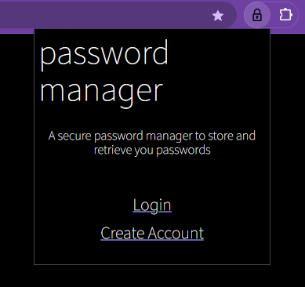
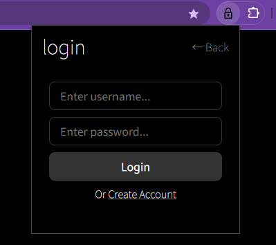
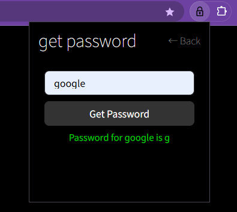

# Password Manager Chrome Extension

A secure, client-side encrypted password manager built as a Chrome extension with a Flask backend. This project demonstrates advanced security practices including JWT authentication, password-based encryption, and secure key derivation.

## Overview

This password manager provides a secure way to store and retrieve website credentials while ensuring that even if the database is compromised, user passwords remain encrypted and inaccessible without the user's master password.

## Screenshots

### Dashboard Page


### Login Page


### Get Password Page


## Key Features

### Security Features
- **JWT Token Authentication**: Secure session management with configurable expiration
- **Password-Based Encryption**: Each user's passwords are encrypted using their master password
- **Secure Key Derivation**: PBKDF2 with salt for cryptographic key generation
- **Zero-Knowledge Architecture**: No encryption keys stored in the database
- **bcrypt Password Hashing**: Industry-standard password hashing for user accounts
- **CORS Support**: Configured for secure cross-origin requests

### User Features
- **Account Management**: Create secure user accounts with encrypted storage
- **Password Storage**: Encrypt and store passwords for multiple websites
- **Password Retrieval**: Securely retrieve stored passwords with master password verification
- **Chrome Extension Interface**: Seamless browser integration
- **Session Management**: Automatic login state persistence

## Security Architecture

### Encryption Flow

1. **Account Creation**
   - User password is hashed with bcrypt and stored
   - Random salt is generated and stored for key derivation

2. **Password Storage Process**
   - User provides their master password
   - System derives encryption key using PBKDF2 with stored salt
   - Website password is encrypted with derived key
   - Encrypted password is stored in database
   - Master password is immediately cleared from memory

3. **Password Retrieval Process**
   - User provides their master password
   - System derives the same encryption key
   - Website password is decrypted and returned
   - Master password is immediately cleared from memory

### Security Guarantees

- **No Key Storage**: Encryption keys are never stored in the database
- **User-Controlled Encryption**: Each user's passwords are encrypted with their own key
- **Password Independence**: Compromise of one user's data doesn't affect others
- **Database Security**: Even with full database access, passwords remain encrypted
- **Memory Security**: Passwords are cleared from memory after each operation

## Technology Stack

### Backend
- **Flask**: Python web framework for API endpoints
- **PyJWT**: JWT token generation and validation
- **bcrypt**: Secure password hashing
- **cryptography**: Advanced encryption operations
- **PyMongo**: MongoDB database integration
- **Flask-CORS**: Cross-origin resource sharing support

### Frontend
- **Chrome Extension API**: Browser integration
- **HTML5/CSS3**: Modern web interface
- **JavaScript**: Client-side logic and API communication
- **Chrome Storage**: Secure extension data storage

### Database
- **MongoDB**: NoSQL database for user data and encrypted passwords

## Installation and Setup

### Prerequisites

- Python 3.7 or higher
- MongoDB (local installation or MongoDB Atlas)
- Google Chrome browser
- Git (for cloning the repository)

### Backend Setup

1. **Clone the repository**
   ```bash
   git clone <repository-url>
   cd password-manager
   ```

2. **Install Python dependencies**
   ```bash
   pip install -r requirements.txt
   ```

3. **Configure MongoDB**
   - Install MongoDB locally, or
   - Set up MongoDB Atlas account
   - Update connection string in `src/backend/app.py` if needed

4. **Configure security settings**
   - Open `src/backend/app.py`
   - Change the `SECRET_KEY` to a secure random string:
   ```python
   app.config['SECRET_KEY'] = 'your-secure-secret-key-here'
   ```

5. **Start the backend server**
   ```bash
   cd src/backend
   python app.py
   ```
   The server will be available at `http://127.0.0.1:5000`

### Chrome Extension Setup

1. **Load the extension in Chrome**
   - Open Chrome and navigate to `chrome://extensions/`
   - Enable "Developer mode" in the top right
   - Click "Load unpacked"
   - Select the `src/frontend` directory

2. **Verify installation**
   - The Password Manager extension should appear in your extensions list
   - Click the extension icon in the Chrome toolbar to access the interface

## Security Considerations

### Current Security Strengths
- JWT tokens with configurable expiration (default: 1 hour)
- Password-based encryption with PBKDF2 key derivation
- No encryption keys stored in database
- bcrypt password hashing with salt
- Secure memory handling (password clearing)
- CORS configuration for development

## Development Guidelines

### Code Organization
- Backend logic is centralized in `app.py` with clear separation of concerns
- Frontend follows modular structure with separate files for different functionalities
- Authentication decorators ensure secure endpoint access
- Error handling provides meaningful feedback to users

### Testing Considerations
- JWT tokens expire after 1 hour by default
- All password operations require master password verification
- Backend automatically extracts username from JWT tokens
- Frontend stores JWT token in localStorage for session persistence


## Support

For questions or issues related to this project, please review the security considerations and/or contact me. 